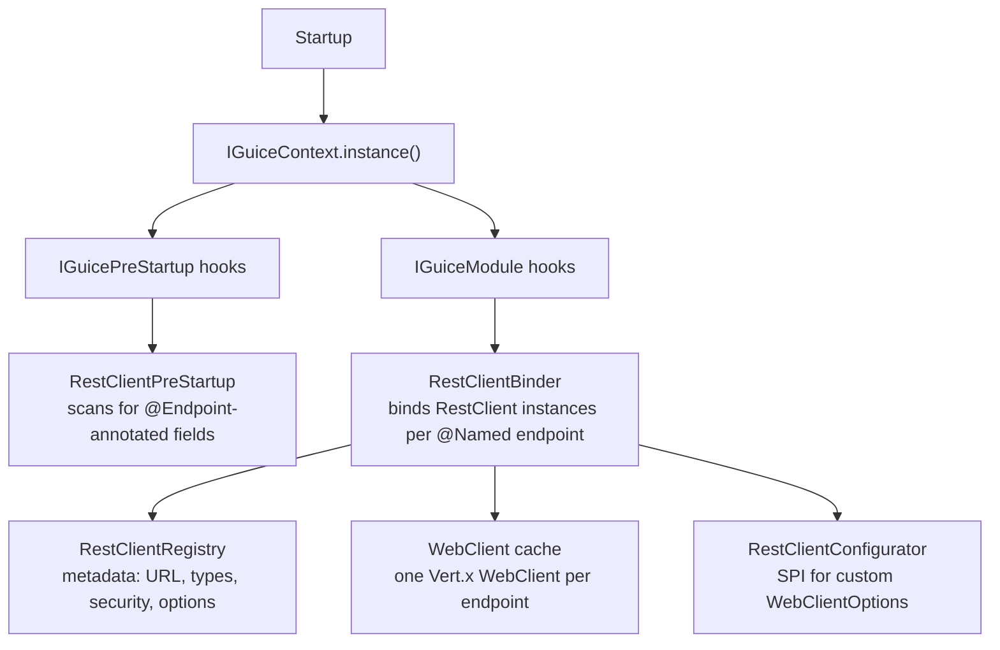
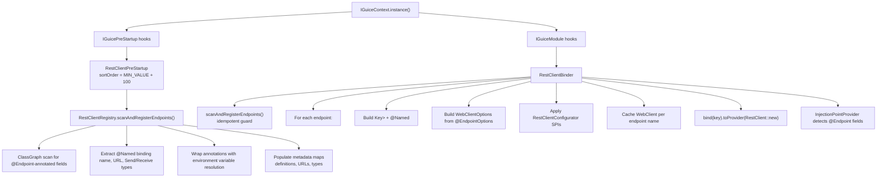
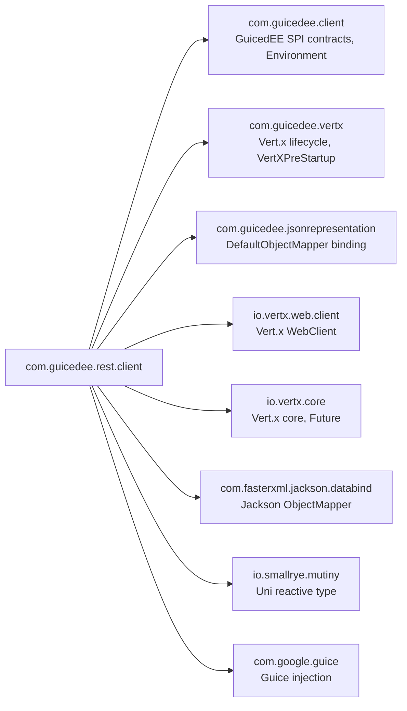

# GuicedEE REST Client

[](https://github.com/GedMarc/GuicedRestClient/actions/workflows/build.yml)
[](https://central.sonatype.com/artifact/com.guicedee/rest-client)
[](https://github.com/GuicedEE/Packages/packages/maven/com.guicedee.rest-client)
[](https://www.apache.org/licenses/LICENSE-2.0)


Annotation-driven **REST client** for [GuicedEE](https://github.com/GuicedEE) applications using the **Vert.x 5 WebClient**.
Declare an `@Endpoint` on any `RestClient<Send, Receive>` field, add `@Named`, and inject — URL, HTTP method, authentication, timeouts, and connection options are all driven from the annotation. Every call returns a `Uni<Receive>` for fully reactive composition.

Built on [Vert.x Web Client](https://vertx.io/docs/vertx-web-client/java/) · [Google Guice](https://github.com/google/guice) · [Mutiny](https://smallrye.io/smallrye-mutiny/) · [Jackson](https://github.com/FasterXML/jackson) · JPMS module `com.guicedee.rest.client` · Java 25+

## 📦 Installation

```xml
<dependency>
  <groupId>com.guicedee</groupId>
  <artifactId>rest-client</artifactId>
</dependency>
```

<details>
<summary>Gradle (Kotlin DSL)</summary>

```kotlin
implementation("com.guicedee:rest-client:2.0.0-RC10")
```
</details>

## ✨ Features

- **Zero-boilerplate REST calls** — annotate a field with `@Endpoint` and `@Named`, inject, call `send()` or `publish()`
- **Fully typed** — `RestClient<Send, Receive>` preserves generic types for Jackson (de)serialization, including collections and nested generics
- **Reactive** — every call returns `Uni<Receive>` for non-blocking composition; fire-and-forget via `publish()`
- **Annotation-driven configuration** — URL, HTTP method, protocol version, authentication, timeouts, and connection tuning all declared on the field
- **Multiple authentication strategies** — Bearer/JWT, Basic, and API Key with environment variable placeholders for secrets
- **Path parameters** — `{paramName}` placeholders in URLs with a fluent `pathParam()` builder, URL-encoded per RFC 3986
- **Environment variable overrides** — every annotation attribute can be overridden via `REST_CLIENT_*` environment variables without code changes
- **Package-level `@Endpoint`** — declare shared base URL and options on `package-info.java` for all clients in a package
- **`RestClientConfigurator` SPI** — hook into WebClient construction for custom SSL, proxy, or other Vert.x options
- **Rich error model** — `RestClientException` carries HTTP status, status message, response body, and cause with `isClientError()` / `isServerError()` / `isTransportError()` helpers
- **Cached WebClients** — one `WebClient` per endpoint name, reused across injections

## 🚀 Quick Start

**Step 1** — Declare a REST client field:

```java
public class UserService {

    @Endpoint(url = "https://api.example.com/users", method = "POST",
              security = @EndpointSecurity(value = SecurityType.Bearer,
                                           token = "${API_TOKEN}"))
    @Named("create-user")
    private RestClient<CreateUserRequest, UserResponse> createUserClient;

    public Uni<UserResponse> createUser(CreateUserRequest request) {
        return createUserClient.send(request);
    }
}
```

**Step 2** — Bootstrap GuicedEE (endpoints are discovered and bound automatically):

```java
IGuiceContext.registerModuleForScanning.add("my.app");
IGuiceContext.instance();
```

That's it. `RestClientRegistry` discovers the `@Endpoint` field, `RestClientBinder` creates the Guice binding, and the `RestClient` is ready for injection.

> **Note:** Only **one** field needs the `@Endpoint` annotation to define the endpoint. After that, any other class can inject the same client using just `@Inject` and `@Named` — no `@Endpoint` required:
>
> ```java
> public class OrderService {
>
>     @Inject
>     @Named("create-user")
>     private RestClient<CreateUserRequest, UserResponse> createUserClient;
> }
> ```

## 📐 Architecture



### Request lifecycle

```
restClient.send(body)
 → Uni.createFrom().deferred()
   → Resolve path parameters ({param} → value)
   → Parse URI (host, port, path, scheme)
   → Create HttpRequest via WebClient
   → Apply timeouts (connect, idle, read)
   → Apply default headers (Accept, Content-Type)
   → Apply authentication (Bearer / Basic / ApiKey)
   → Apply query params from URI + additional params
   → Serialize body via DefaultObjectMapper → Buffer
   → Send request (sendBuffer / send)
   → Map response:
       2xx → Deserialize body via DefaultObjectMapper → Receive
       non-2xx → RestClientException (status, message, body)
       transport error → RestClientException (cause)
```

## 🛣️ Endpoint Declaration

### Field-level `@Endpoint`

The primary way to declare a REST client — annotate a `RestClient<Send, Receive>` field:

```java
@Endpoint(url = "https://api.example.com/users/{userId}",
          method = "GET",
          options = @EndpointOptions(connectTimeout = 5000, readTimeout = 10000))
@Named("get-user")
private RestClient<Void, UserResponse> getUserClient;
```

### Package-level `@Endpoint`

Declare a shared base URL and default options for all clients in a package via `package-info.java`:

```java
@Endpoint(url = "http://localhost:8080/api",
          options = @EndpointOptions(readTimeout = 1000))
package com.example.api;

import com.guicedee.rest.client.annotations.Endpoint;
import com.guicedee.rest.client.annotations.EndpointOptions;
```

Field-level URLs that start with `/` are appended to the package-level base URL.

### Binding names

The `@Named` annotation determines the Guice binding key. Once an `@Endpoint` is registered, the client can then be injected by name.

```java
// Inject by name
@Named("create-user")
@Inject
private RestClient<CreateUserRequest, UserResponse> client;

// Or retrieve programmatically
RestClient<?, ?> client = IGuiceContext.get(
    Key.get(RestClient.class, Names.named("create-user")));
```

## 📡 Sending Requests

### Simple send (no body)

```java
Uni<UserResponse> response = client.send();
```

### Send with body

```java
Uni<UserResponse> response = client.send(new CreateUserRequest("Alice"));
```

### Send with headers and query parameters

```java
Uni<UserResponse> response = client.send(
    body,
    Map.of("X-Request-Id", "abc123"),      // headers
    Map.of("page", "1", "limit", "10")     // query params
);
```

### Path parameters

Use `{paramName}` placeholders in the endpoint URL:

```java
@Endpoint(url = "https://api.example.com/users/{userId}/orders/{orderId}",
          method = "GET")
@Named("get-order")
private RestClient<Void, OrderResponse> orderClient;

// Fluent builder
Uni<OrderResponse> response = orderClient
    .pathParam("userId", "123")
    .pathParam("orderId", "456")
    .send();
```

Path parameter values are URL-encoded automatically (RFC 3986). Unresolved placeholders throw `IllegalArgumentException`.

### Fire-and-forget

```java
Uni<Void> done = client.publish(body);
```

### Fluent request builder

Chain path parameters, headers, and query parameters:

```java
Uni<OrderResponse> response = orderClient
    .pathParam("userId", "123")
    .pathParam("orderId", "456")
    .headers(Map.of("X-Correlation-Id", correlationId))
    .queryParams(Map.of("expand", "items"))
    .send();
```

## 📤 Response Handling

### Typed deserialization

Response bodies are deserialized using the `DefaultObjectMapper` (Jackson) based on the `Receive` type parameter:

| Receive type | Behavior |
|---|---|
| `String` | Response body as UTF-8 string |
| `byte[]` | Raw response bytes |
| Any class | Jackson deserialization via full generic type |
| `Void` / `Object` | Raw `Buffer` returned |

### Status code handling

| Status | Behavior |
|---|---|
| 2xx | Deserialized body returned in `Uni` |
| Non-2xx | `Uni.failure(RestClientException)` with status, message, and body |
| Transport error | `Uni.failure(RestClientException)` with cause |

### Error handling

```java
client.send(request)
    .subscribe().with(
        response -> log.info("Success: {}", response),
        err -> {
            if (err instanceof RestClientException rce) {
                if (rce.isClientError()) {
                    log.warn("Client error {}: {}", rce.getStatusCode(), rce.getResponseBody());
                } else if (rce.isServerError()) {
                    log.error("Server error {}: {}", rce.getStatusCode(), rce.getStatusMessage());
                } else if (rce.isTransportError()) {
                    log.error("Connection failed: {}", rce.getMessage());
                }
            }
        }
    );
```

## 🔒 Security

### `@EndpointSecurity`

Authentication is configured via the `security` attribute of `@Endpoint`:

```java
@Endpoint(url = "https://api.example.com/data",
          security = @EndpointSecurity(value = SecurityType.Bearer,
                                       token = "${API_TOKEN}"))
```

### Authentication strategies

| `SecurityType` | Header | Source attributes |
|---|---|---|
| `Bearer` | `Authorization: Bearer <token>` | `token` |
| `JWT` | `Authorization: Bearer <token>` | `token` |
| `Basic` | `Authorization: Basic <base64>` | `username`, `password` |
| `ApiKey` | `<apiKeyHeader>: <apiKey>` | `apiKey`, `apiKeyHeader` (default `X-API-Key`) |
| `None` | *(no authentication)* | — |

### Environment variable placeholders

All credential values support `${VAR_NAME}` syntax, resolved via system properties or environment variables:

```java
@EndpointSecurity(value = SecurityType.Bearer, token = "${API_TOKEN}")
```

```bash
export API_TOKEN=eyJhbGciOiJIUzI1NiIs...
```

### Per-endpoint environment overrides

Security values can also be overridden via naming convention:

| Variable | Purpose |
|---|---|
| `REST_CLIENT_TOKEN_<endpointName>` | Override Bearer/JWT token |
| `REST_CLIENT_USERNAME_<endpointName>` | Override Basic username |
| `REST_CLIENT_PASSWORD_<endpointName>` | Override Basic password |
| `REST_CLIENT_API_KEY_<endpointName>` | Override API key |
| `REST_CLIENT_API_KEY_HEADER_<endpointName>` | Override API key header name |

## ⚙️ Configuration

### `@EndpointOptions`

Connection tuning and behavior options. All timing values are in milliseconds; `0` means "use Vert.x default":

| Attribute | Default | Purpose |
|---|---|---|
| `connectTimeout` | `0` | TCP connect timeout (ms) |
| `idleTimeout` | `0` | Idle connection timeout (ms) |
| `readTimeout` | `0` | Response timeout per request (ms) |
| `trustAll` | `false` | Trust all server certificates (**dev only**) |
| `verifyHost` | `true` | Verify server hostname against certificate |
| `ssl` | `false` | Force SSL/TLS (auto-detected from `https` URLs) |
| `maxPoolSize` | `0` | Max connection pool size |
| `keepAlive` | `true` | TCP keep-alive between requests |
| `decompression` | `true` | Auto-decompress gzip/deflate responses |
| `followRedirects` | `true` | Follow HTTP redirects automatically |
| `maxRedirects` | `0` | Max redirect hops |
| `defaultContentType` | `application/json` | Default `Content-Type` header |
| `defaultAccept` | `application/json` | Default `Accept` header |
| `retryAttempts` | `0` | Retry count on connection failure |
| `retryDelay` | `1000` | Delay between retries (ms) |

```java
@Endpoint(url = "https://slow-api.example.com/data",
          method = "GET",
          options = @EndpointOptions(
              connectTimeout = 5000,
              readTimeout = 30000,
              maxPoolSize = 10,
              retryAttempts = 3,
              retryDelay = 2000
          ))
@Named("slow-api")
private RestClient<Void, DataResponse> slowApiClient;
```

### Environment variable overrides

Every `@EndpointOptions` attribute can be overridden per endpoint via environment variables:

| Variable | Purpose |
|---|---|
| `REST_CLIENT_URL_<name>` | Override endpoint URL |
| `REST_CLIENT_METHOD_<name>` | Override HTTP method |
| `REST_CLIENT_PROTOCOL_<name>` | Override protocol (`HTTP` / `HTTP2`) |
| `REST_CLIENT_CONNECT_TIMEOUT_<name>` | Override connect timeout |
| `REST_CLIENT_IDLE_TIMEOUT_<name>` | Override idle timeout |
| `REST_CLIENT_READ_TIMEOUT_<name>` | Override read timeout |
| `REST_CLIENT_TRUST_ALL_<name>` | Override trust-all flag |
| `REST_CLIENT_VERIFY_HOST_<name>` | Override hostname verification |
| `REST_CLIENT_SSL_<name>` | Override SSL flag |
| `REST_CLIENT_MAX_POOL_SIZE_<name>` | Override connection pool size |
| `REST_CLIENT_KEEP_ALIVE_<name>` | Override keep-alive flag |
| `REST_CLIENT_DECOMPRESSION_<name>` | Override decompression flag |
| `REST_CLIENT_FOLLOW_REDIRECTS_<name>` | Override follow-redirects flag |
| `REST_CLIENT_MAX_REDIRECTS_<name>` | Override max redirect hops |
| `REST_CLIENT_CONTENT_TYPE_<name>` | Override default Content-Type |
| `REST_CLIENT_ACCEPT_<name>` | Override default Accept |
| `REST_CLIENT_RETRY_ATTEMPTS_<name>` | Override retry count |
| `REST_CLIENT_RETRY_DELAY_<name>` | Override retry delay |

Where `<name>` is the `@Named` value of the endpoint.

### HTTP/2

```java
@Endpoint(url = "https://http2-api.example.com/stream",
          method = "GET",
          protocol = Protocol.HTTP2)
@Named("http2-api")
private RestClient<Void, StreamResponse> http2Client;
```

## 🔌 SPI Extension Points

### `RestClientConfigurator`

Hook into `WebClientOptions` construction for custom SSL keystores, proxy settings, or other Vert.x options not covered by the annotation model:

```java
public class MyRestClientConfigurator implements RestClientConfigurator {

    @Override
    public WebClientOptions configure(String endpointName, Endpoint endpoint,
                                      WebClientOptions options) {
        if ("secure-api".equals(endpointName)) {
            options.setKeyCertOptions(myKeyCert);
            options.setProxyOptions(new ProxyOptions()
                .setHost("proxy.internal").setPort(3128));
        }
        return options;
    }
}
```

Register via JPMS:

```java
module my.app {
    requires com.guicedee.rest.client;

    provides com.guicedee.rest.client.RestClientConfigurator
        with my.app.MyRestClientConfigurator;
}
```

## 💉 Dependency Injection

`RestClient` instances are bound by `RestClientBinder` using the full parameterized type and `@Named` qualifier:

```java
public class OrderService {

    @Inject
    @Endpoint(url = "https://api.example.com/orders", method = "POST")
    @Named("create-order")
    private RestClient<OrderRequest, OrderResponse> orderClient;

    @Inject
    @Endpoint(url = "https://api.example.com/orders/{id}", method = "GET")
    @Named("get-order")
    private RestClient<Void, OrderResponse> getOrderClient;

    public Uni<OrderResponse> createOrder(OrderRequest request) {
        return orderClient.send(request);
    }

    public Uni<OrderResponse> getOrder(String id) {
        return getOrderClient.pathParam("id", id).send();
    }
}
```

### Injection point detection

`RestClientInjectionPointProvision` implements `InjectionPointProvider` to detect `@Endpoint`-annotated fields, ensuring Guice creates bindings for all discovered endpoints at startup.

## ❌ Error Handling

### `RestClientException`

All failures — HTTP errors, deserialization errors, and transport errors — are surfaced as `RestClientException`:

| Method | Returns `true` when |
|---|---|
| `isClientError()` | Status 400–499 |
| `isServerError()` | Status 500–599 |
| `isTransportError()` | No HTTP status (connection failure) |

| Getter | Purpose |
|---|---|
| `getStatusCode()` | HTTP status code (0 if transport error) |
| `getStatusMessage()` | HTTP status message or error description |
| `getResponseBody()` | Raw response body (if available) |

## 🔄 Startup Flow



## 🗺️ Module Graph



## 🧩 JPMS

Module name: **`com.guicedee.rest.client`**

The module:
- **exports** `com.guicedee.rest.client`, `com.guicedee.rest.client.annotations`, `com.guicedee.rest.client.implementations`
- **provides** `IGuiceModule` with `RestClientBinder`
- **provides** `IGuicePreStartup` with `RestClientPreStartup`
- **provides** `InjectionPointProvider` with `RestClientInjectionPointProvision`
- **uses** `RestClientConfigurator`

In non-JPMS environments, `META-INF/services` discovery still works.

## 🏗️ Key Classes

| Class | Package | Role |
|---|---|---|
| `RestClient` | `client` | Injectable REST client — `send()`, `publish()`, `pathParam()`, response deserialization |
| `RestClient.RequestBuilder` | `client` | Fluent builder for path params, headers, and query params |
| `RestClientException` | `client` | Unchecked exception with status code, message, body, and error category helpers |
| `RestClientConfigurator` | `client` | SPI for customizing `WebClientOptions` per endpoint |
| `Endpoint` | `annotations` | Annotation declaring URL, method, protocol, security, and options |
| `EndpointSecurity` | `annotations` | Nested annotation for authentication (Bearer, Basic, ApiKey) |
| `EndpointOptions` | `annotations` | Nested annotation for timeouts, SSL, pooling, retries |
| `RestClientRegistry` | `implementations` | Static registry — scans `@Endpoint` fields, stores metadata |
| `RestClientBinder` | `implementations` | Guice module — binds `RestClient` per `@Named` endpoint |
| `RestClientProvider` | `implementations` | Guice provider — constructs `RestClient` from registry metadata |
| `RestClientPreStartup` | `implementations` | Pre-startup hook — triggers classpath scanning |
| `RestClientInjectionPointProvision` | `implementations` | `InjectionPointProvider` — detects `@Endpoint` fields for binding |

## 🤝 Contributing

Issues and pull requests are welcome — please add tests for new authentication strategies, response types, or WebClient options.

## 📄 License

[Apache 2.0](https://www.apache.org/licenses/LICENSE-2.0)
